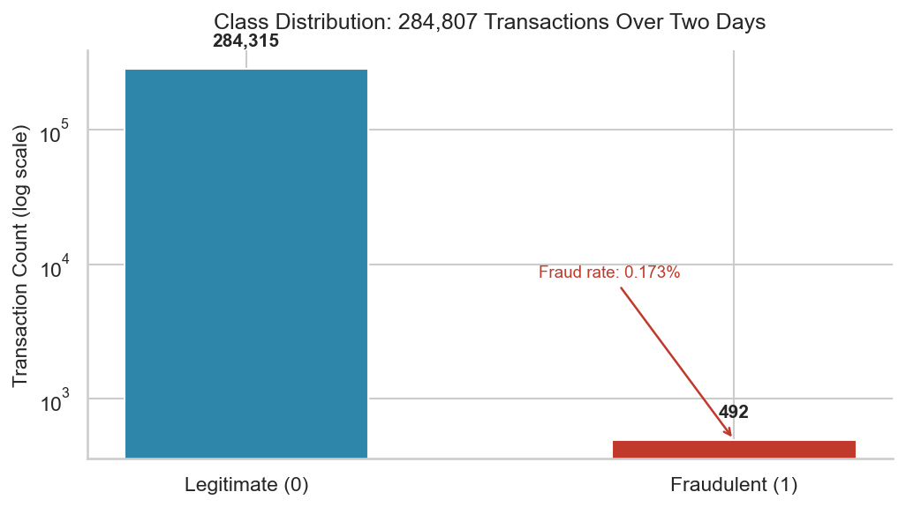
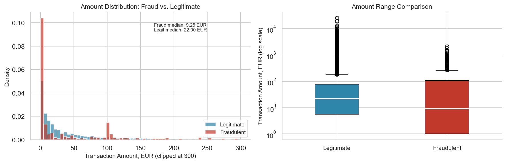
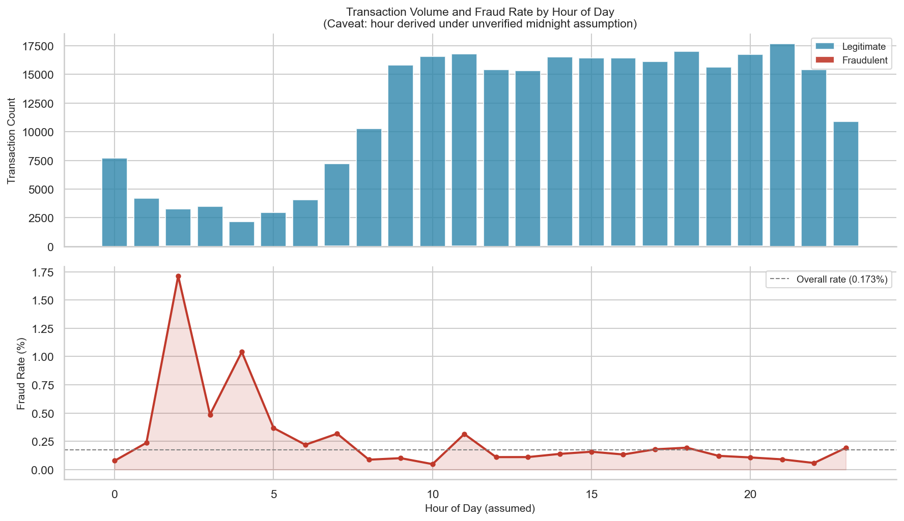
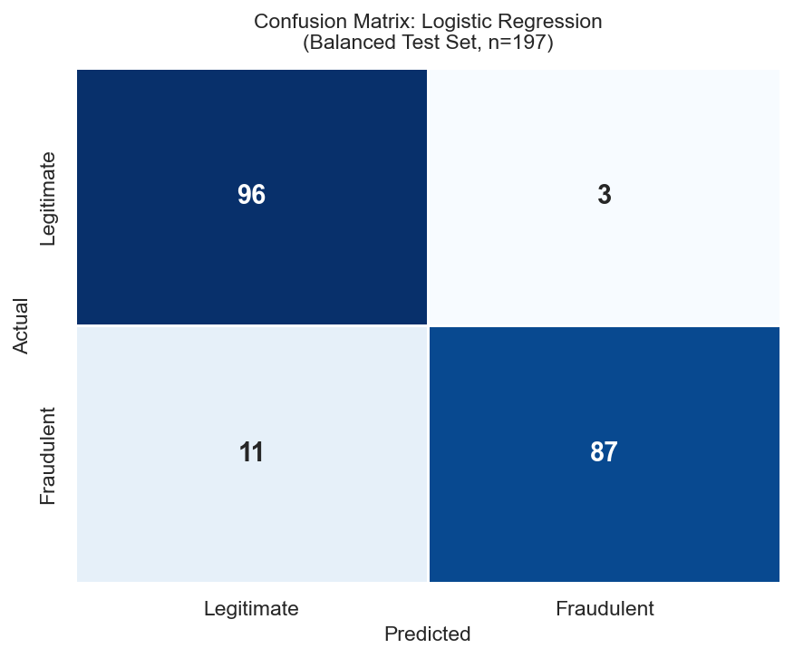

# AML-Lensed Credit Card Fraud Analysis

I built this project to think about transaction data the way an AML analyst would, not the way a data scientist would. Most fraud notebooks on GitHub treat the 0.17% fraud rate as a modeling inconvenience. In transaction monitoring, it is the operational reality. The precision-recall tradeoff is a staffing decision before it is a technical one.

This is a proof-of-concept analysis, not a production model. The framing matters more than the classifier.

## Why an AML Lens

Standard fraud notebooks optimize for accuracy or F1 on a leaderboard. This one asks different questions: What does a false positive cost in analyst-hours? When would a compliance officer choose high recall over high precision, and why? What would a transaction monitoring rule designer actually do with these findings?

The model choice reflects this framing. I used Logistic Regression rather than a more complex algorithm because GDPR Article 22 requires that automated decisions affecting customers be explainable. A neural network that outputs a fraud score of 0.87 cannot tell an analyst which features drove that score. Logistic Regression can. In a compliance context, that is not a concession, it is a requirement.

## Methodology

- **Dataset:** 284,807 European credit card transactions over two days (September 2013). 492 fraud cases. 0.173% fraud rate.
- **Model:** Logistic Regression, chosen for regulatory explainability under GDPR Article 22. Feature weights are extractable and can populate alert narratives.
- **Imbalance handling:** Random under-sampling to a balanced training pool of 984 transactions (492 fraud, 492 legitimate). Full-dataset evaluation is included separately and gives a more honest picture of real-world performance.
- **Threshold analysis:** Two named configurations. Configuration A (threshold = 0.30, high-recall, FATF-aligned) and Configuration B (threshold = 0.70, high-precision, cost-constrained). Each includes an operational scenario describing when an institution would choose it.
- **Analyst workload simulation:** False positive counts translated into analyst-hours using a stated 15-minute L1 triage assumption. Computed from actual model output.
- **TM rules:** Three hypothetical transaction monitoring rules derived from EDA findings, each with a regulatory citation or a clearly marked citation placeholder.

## Key Findings

All numbers come from the model applied to the full 284,807-transaction dataset, not the balanced test set.

- At the default threshold (0.50): 456 of 492 fraud cases caught (92.7% recall), generating 10,035 false positives. At 15 minutes per review, that is 2,509 analyst-hours of unnecessary work across the 48-hour window, equivalent to roughly 314 FTE on a single shift.
- Configuration A (threshold 0.30, high-recall): catches 469 fraud cases (95.3% recall) at the cost of 21,445 false positives and 5,361 analyst-hours.
- Configuration B (threshold 0.70, high-precision): catches 446 fraud cases (90.7% recall), reduces false positives to 5,479, and cuts analyst workload to 1,370 hours. Misses 46 confirmed fraud cases.
- Fraudulent transactions cluster heavily in the sub-10 EUR range (median: 9.25 EUR vs. 22.00 EUR for legitimate). This pattern is consistent with credential testing behavior documented in FATF payment card fraud typologies.
- Fraud rate peaks at hours 2, 3, and 4 (1.71%, 0.49%, 1.04% respectively vs. 0.173% baseline) under an unverified midnight assumption. Consistent with automated script activity during low-oversight periods.


492 fraudulent transactions in 284,807 total. The log scale is necessary to make both bars visible; the raw disparity is the needle-in-a-haystack problem in numerical form.


Fraudulent transactions cluster in the sub-10 EUR range (median: 9.25 EUR) versus 22.00 EUR for legitimate. The low-value concentration is consistent with credential-testing behavior before escalating to larger purchases.


Fraud rate at hours 2 and 4 reaches 1.71% and 1.04%, roughly 6-10x the 0.173% baseline. Derived under an unverified midnight assumption; the relative spike pattern holds regardless of absolute time.


On the balanced test set (50/50 split, n=197): 87 of 98 fraud cases correctly flagged, 3 false positives out of 99 legitimate transactions. Full-dataset precision is 4.3%, not 97%. See Section 4 in the notebook for both evaluations.

## What This Project Is Not

- A state-of-the-art fraud detection system. Precision on the full dataset is 4.3% at the default threshold. That is expected and honest; the model was trained on 984 transactions.
- Evidence of money laundering. Fraud and money laundering are distinct legal offences with different elements and reporting obligations. A fraud probability score is not a suspicion in the POCA 2002 sense.
- A production model. Two days of training data, no customer-level context, no KYC tier, no account history.
- A Kaggle leaderboard entry. The goal was not to maximize F1.

Precision on the balanced test set (0.97) reflects the 50/50 training distribution. On the full dataset, precision drops to 0.043, which is expected and honest. The balanced metric is a model-quality signal; the unbalanced metric is the operational reality. This is why threshold tuning matters.

## Setup

```bash
git clone https://github.com/YagizEgeDemirel/aml-credit-card-fraud-analysis.git
cd aml-credit-card-fraud-analysis
pip install -r requirements.txt
```

Download the dataset from [Kaggle](https://www.kaggle.com/datasets/mlg-ulb/creditcardfraud) and place `creditcard.csv` in the `/data` folder. The file is not committed to this repository (143 MB, excluded by `.gitignore`).

Open `notebooks/fraud_analysis.ipynb` and run all cells in order.

## Project Structure

```
aml-credit-card-fraud-analysis/
├── data/                     # CSV goes here (not committed)
├── notebooks/
│   └── fraud_analysis.ipynb  # Main analysis notebook
├── visualizations/           # PNGs generated by the notebook
│   ├── 01_class_distribution.png
│   ├── 02_amount_by_class.png
│   ├── 03_temporal_pattern.png
│   └── 04_confusion_matrix.png
├── requirements.txt
└── README.md
```

## Tools

Python 3.11, pandas, numpy, scikit-learn, matplotlib, seaborn.

No proprietary libraries. Reproducible with a fixed random seed (42) throughout.

## About the Author

I am a final-year Law student at Kırıkkale University (graduating June 2026), concurrently studying Economics at Anadolu University.

Basel Institute on Governance certifications: Operational Analysis of Suspicious Transaction Reports; International Cooperation in Financial Matters. ACAMS certification in Wildlife Trade Finance.

Previously conducted an independent OSINT investigation on Troika Securities Limited (BVI-registered entity from the ICIJ Panama Papers) using Basel STR format. Also built SCOS, a RegTech compliance workflow tool for German SMEs.

Looking for junior roles in AML analysis, financial crime investigation, or fraud operations at fintech and crypto compliance firms.

LinkedIn: https://www.linkedin.com/in/ya%C4%9F%C4%B1z-ege-demirel-617688198/

## License

MIT License. Analysis and commentary are my own work.

Dataset: Université Libre de Bruxelles (Andrea Dal Pozzolo, Olivier Caelen, Reid A. Johnson, Gianluca Bontempi). Please cite the original authors if you use the dataset.

## Disclaimer

This project uses a publicly available, fully anonymized dataset for educational and portfolio purposes. No personal financial data is included. Features V1-V28 are PCA-transformed by the original dataset publishers and do not contain personally identifiable information.
